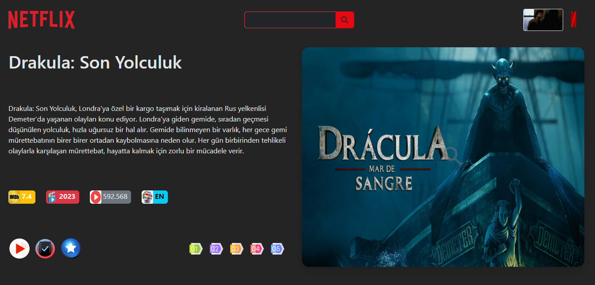

# Netflix Redux Film Projesi

Bu proje, film meraklıları için özel olarak tasarlanmış bir React, Vite ve Redux uygulamasıdır.

## Proje Özellikleri

Projenin öne çıkan özellikleri şunlardır:

- Anasayfada her yenilemede popüler bir filmle sizi karşılar.
- Kategorilere göre filmlerin listelenmesi.
- Film veya oyuncu adına göre arama yapabilme (ilk 20 sonuçla sınırlıdır).
- Posterlara tıklayarak film detaylarına ulaşma.
- Film detay sayfasında film bağlantısına erişim.
- Alt kısımda oyuncu ve prodüksiyon ekibi bilgileri ile yorumlar.
- Yorumlar kısmı yorum yapanın resmi ve aldığı puana göre dinamik simgeli
- Favori ve izleme listeleri oluşturabilme (veriler JSON sunucusunda saklanır).
- Listelerde film ekleme ve çıkarma işlevleri.
- Tüm filmler üzerinde liste ekleme ve fragman izleme seçenekleri.
- Fragmanlar için açılır pencere (Real Player eklentisi kullanıldı).
--Film detay sayfasında seçili film ile gelen öneriler ile filmin görselleri eklendi.
--İntro sayfası eklendi gif animasyonu içeren...
- Daha fazla özellik için projeyi inceleyip geri bildirimlerinizi iletebilirsiniz.

## Projeyi Deneyin

Projeyi yerel makinenizde çalıştırmak için şu adımları izleyin:

1. Repository'yi klonlayın: `git clone https://github.com/yourusername/Netflix-Redux.git`
2. Proje klasörüne gidin: `cd Netflix-Redux`
3. Gerekli bağımlılıkları yüklemek için: `npm install` veya `yarn install`
4. Projeyi başlatmak için: `npm start` veya `yarn start`
5. JSON sunucusunu başlatmak için: `npm run server` veya `yarn run server`

Bu proje, API bağlantısı için Axios kullanmaktadır ve [The Movie Database](https://api.themoviedb.org/3) API'sini kullanmaktadır.

## Önizleme

Projeyi inceleyerek daha fazla özelliği keşfedin ve geri bildirimlerinizi iletmekten çekinmeyin!

# Netflix-Redux
